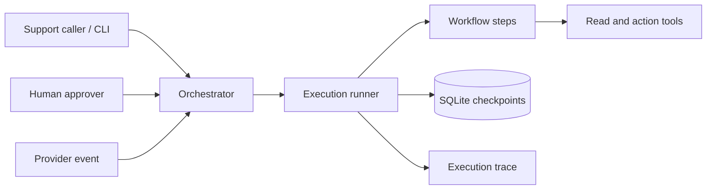

# AI Agent Orchestration

This project demonstrates a durable customer-support refund workflow. It retrieves case data,
checks the refund policy, waits for human approval, submits a refund, waits for payment-provider
confirmation, and notifies the customer.

The workflow uses deterministic mock tools so the reliability behavior can be demonstrated without
external services.

## What this demonstrates

- Five ordered workflow steps with persisted run and step state.
- Human approval before a financial side effect.
- A pause for an asynchronous provider-confirmation event.
- SQLite checkpoints that survive a new CLI process.
- Idempotent refund and notification actions.
- Bounded retries for temporary tool failures.
- Failure handling, cancellation, execution limits, and structured traces.

## Architecture



The CLI is a thin command layer. The orchestrator validates commands, the runner selects the next
unfinished step, and the persistence layer saves every checkpoint. The provider event is simulated
with the `resume` command.

## Workflow

1. `collect_case_context` reads the support request, order, and refund history.
2. `assess_eligibility` checks ownership, order age, and previous refunds.
3. `approve_and_issue_refund` pauses for approval, then submits an approved full refund.
4. `await_provider_confirmation` pauses until `refund.confirmed` is received.
5. `notify_customer` sends the final confirmation and completes the run.

An eligible request pauses before the refund action. After the refund result is saved, the run pauses
again before notification. Ineligible and rejected requests complete without a refund.

## Setup

From the repository root:

```bash
python3 -m venv .venv
source .venv/bin/activate
python -m pip install -e ".[dev]"
```

The project has no runtime dependencies. The development extras install `pytest` and `ruff`.

## Demo

The CLI uses `data/runs.sqlite3` by default. Run the commands below in order. Copy the `run_id`
printed by `start` and replace `<run_id>` in the following commands.

```bash
rm -f data/runs.sqlite3 data/runs.sqlite3-wal data/runs.sqlite3-shm

python -m refund_agent start --request-id REQ-1001
python -m refund_agent inspect <run_id>
python -m refund_agent approve <run_id> --decision approve
python -m refund_agent inspect <run_id>
python -m refund_agent resume <run_id> --event refund.confirmed
python -m refund_agent inspect <run_id>
python -m refund_agent trace <run_id>
```

`start` returns a run ID. `inspect` shows the full state. `approve`, `resume`, and `cancel` return a
short status summary. `trace` shows the execution history. Every command opens the same SQLite file,
so each command can run in a separate process.

To use a separate database while experimenting, pass a path before the command:

```bash
python -m refund_agent --db /tmp/refund-experiment.sqlite3 start --request-id REQ-1001
```

## CLI commands

| Command | Purpose |
| --- | --- |
| `start --request-id ID` | Create and run a new workflow until its first pause. |
| `inspect RUN_ID` | Show the complete persisted run and step state. |
| `approve RUN_ID --decision approve\|reject` | Record the human decision. |
| `resume RUN_ID --event refund.confirmed` | Apply the provider event and continue the run. |
| `cancel RUN_ID` | Cancel a non-terminal run. |
| `trace RUN_ID` | Show the structured execution history. |

Use `python -m refund_agent --help` for the built-in command help.

## Verification

```bash
python -m pytest -q
python -m ruff check .
python -m ruff format --check .
git diff --check
```

## Repository layout

```text
docs/                         Workflow, architecture, state, scenarios, and demo docs
src/refund_agent/
  domain/                     Run and step states and records
  orchestration/              Command boundary, runner, workflow, and views
  persistence/                SQLite, migrations, idempotency, and trace storage
  tools/                      Tool protocols and deterministic mock implementations
tests/                        Workflow, CLI, persistence, and reliability tests
pyproject.toml                Package metadata and development tooling
```

## Design limits

This is a focused orchestration prototype. It does not include real payment, messaging, or support
integrations, authentication, partial refunds, exchanges, multiple orders, or multiple agents. Those
integrations can be added behind the tool interfaces without changing the workflow state model.

More detail is available in:

- [Workflow specification](docs/workflow-spec.md)
- [Architecture and design decisions](docs/architecture.md)
- [Run and step state model](docs/state-model.md)
- [Scenarios](docs/scenarios.md)
- [Demo commands](docs/demo-commands.md)
- [Demo transcript](docs/demo-transcript.md)
