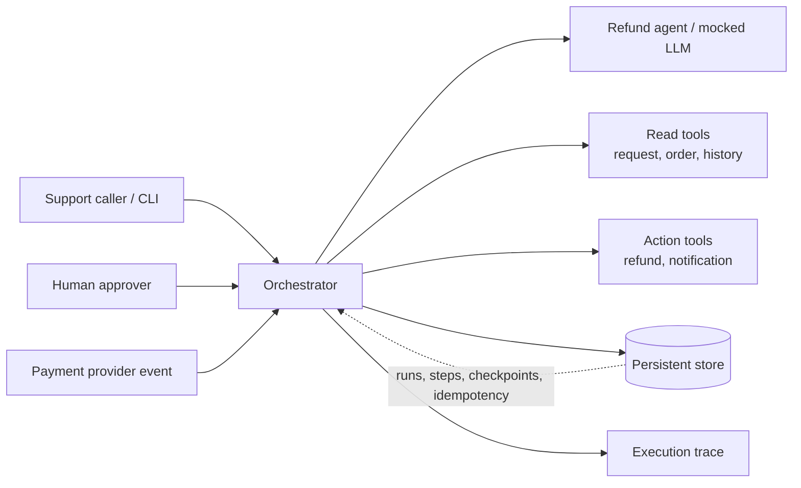

# Architecture

The system is a small CLI-driven orchestration service. The orchestrator owns workflow state and
checkpointing. The agent produces an eligibility recommendation, while deterministic workflow rules
and human approval control the refund action.

## Responsibilities

- **CLI:** starts and inspects runs, records approval decisions, resumes paused runs, and cancels
  runs.
- **Orchestrator:** selects the next step, validates transitions, handles retries, pauses, resume,
  cancellation, and bounded execution.
- **Refund agent:** evaluates the gathered case context and returns a recommendation and reason. It
  is mocked for repeatable tests and cannot bypass the approval gate.
- **Tools:** expose narrow read and side-effecting interfaces. The side-effecting tools accept
  idempotency keys.
- **Persistent store:** uses a local SQLite database so a paused run can be recovered after a
  process restart.
- **Execution trace:** stores one record for each step attempt and state transition without secrets.

## Main execution path

1. The CLI asks the orchestrator to create a run.
2. The orchestrator retrieves case context and persists the completed results.
3. The agent evaluates eligibility and the orchestrator persists the recommendation.
4. The run pauses for approval.
5. After approval, the orchestrator calls the refund tool with a stable idempotency key and persists
   the result.
6. The run pauses for a provider-confirmation event.
7. After resuming, the orchestrator sends the customer notification and completes the run.

## Design trade-offs

- A CLI keeps the interface small and makes the restart demo easy to reproduce. The orchestrator is
  kept separate from the CLI so an HTTP API can be added later.
- SQLite provides durable local state without requiring an external service. A production system
  would need stronger concurrency controls, migrations, authentication, and operational monitoring.
- Mocked tools and a mocked agent make tests deterministic and free of external API costs. Real
  integrations can be added behind the same tool interfaces.
