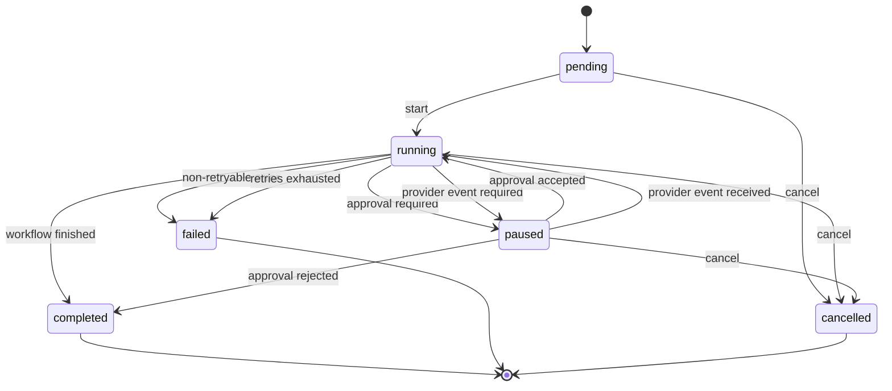
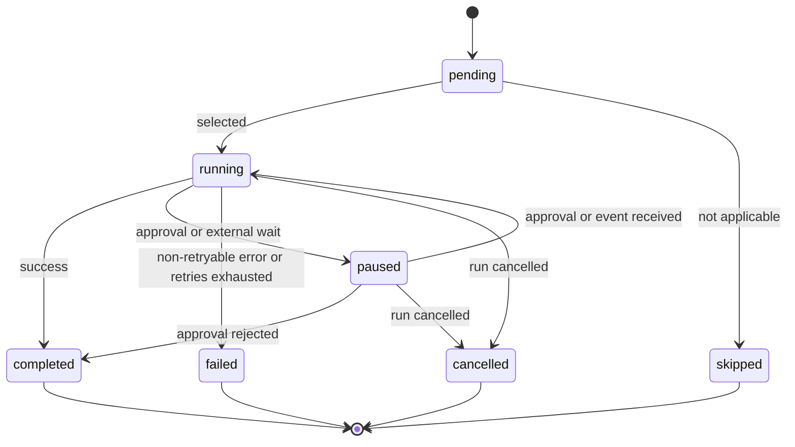

# Run and Step State Model

## Run lifecycle

The run state describes the lifecycle of the complete refund workflow. A paused run stores a
pause reason and the information required to resume it.

`completed` can represent a successful refund, an ineligible request, or an approval rejection.
The business outcome is stored separately from the run state.

## Run transitions

| Current state | Event | Next state | Notes |
| --- | --- | --- | --- |
| `pending` | start | `running` | The first step is selected. |
| `running` | approval required | `paused` | The refund action has not run. |
| `running` | provider event required | `paused` | The refund result is already persisted. |
| `running` | workflow finished | `completed` | A business outcome is recorded. |
| `running` | non-retryable error | `failed` | Later steps do not run. |
| `running` | retry limit reached | `failed` | The trace contains every attempt. |
| `paused` | approval accepted | `running` | Resume at the approval/refund step. |
| `paused` | approval rejected | `completed` | Complete with outcome `rejected`. |
| `paused` | provider event received | `running` | Resume at provider confirmation. |
| `pending`, `running`, or `paused` | cancel | `cancelled` | No future step may execute. |

Completed, failed, and cancelled runs are terminal. Repeating a command against a terminal run is
safe and does not execute another step.

## Step lifecycle

The orchestrator resumes at the first step that is not terminal. A step with status `completed`,
`failed`, `skipped`, or `cancelled` is never executed again during resume.

## Checkpoint rules

- Persist the run and step records when a run is created.
- Persist every state transition before returning control to the caller.
- Persist the approval decision before continuing to the refund action.
- Persist the refund result before entering the provider-confirmation pause.
- Persist the provider event before continuing to notification.
- Record the stable idempotency key before invoking a side-effecting tool.
- If the process stops after a tool succeeds but before the step is marked completed, retry with
  the same key. The tool must return the existing result instead of creating a duplicate effect.

## Duplicate commands

- Repeating the same approval decision is a no-op.
- A conflicting approval decision after the first decision is rejected.
- Repeating a provider event after completion is a no-op.
- Resuming a completed, failed, or cancelled run does not execute a tool.
